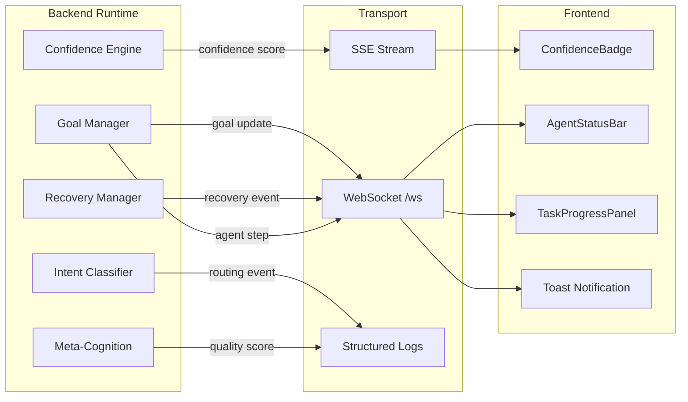
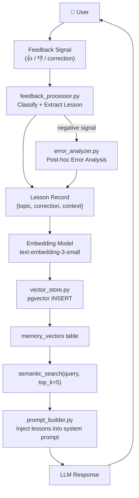

# Both AI — Architecture

## Overview
Both AI is a Superintelligence Autonomous platform that orchestrates
multiple AI models to handle user requests. Users interact with a
single unified identity (Both), while internally the system routes
each request to the most capable model available. The Supervisor
Orchestration Layer coordinates all sub-agents, maintains persistent
goals across sessions, evaluates its own output quality before
responding, and continuously improves from user feedback.

---

## Tech Stack

| Layer      | Technology                         |
|------------|------------------------------------|
| Frontend   | React + Vite (TypeScript)          |
| Backend    | Python, FastAPI                    |
| Database   | PostgreSQL (Neon) + pgvector       |
| Deploy     | Vercel                             |
| Auth       | JWT + Google OAuth + GitHub OAuth  |
| Payment    | Xendit                             |
| Real-time  | SSE (short responses) + WebSocket  |
| Vector DB  | pgvector (semantic memory)         |

---

## AI Models & Duties

| Model       | Provider | Exact Model ID                 | Primary Duty                          |
|-------------|----------|--------------------------------|---------------------------------------|
| Nemotron    | NVIDIA   | nemotron-3-super-120b-a12b     | General chat, Q&A, everyday tasks     |
| Deepseek    | NVIDIA   | deepseek-v3.2                  | Math, logic, analytical reasoning     |
| Qwen        | NVIDIA   | qwen3.5-122b-a10b              | Coding, debugging, code explanation   |
| Kimi        | NVIDIA   | kimi-k2.5                      | Long documents, PDF analysis          |
| Minimax     | NVIDIA   | minimax-m2.7                   | Creative writing, copywriting         |
| GLM         | NVIDIA   | glm-5.1                        | Multilingual, Chinese language        |
| Gemma       | NVIDIA   | gemma-4-31b-it                 | Instruction following, backup general |
| Mistral     | NVIDIA   | mistral-small-4-119b-2603      | Multilingual support, fast response   |
| Gemini      | Google   | gemini-2.0-flash               | Research, web-aware, image analysis   |
| Groq        | Groq     | llama-3.3-70b-versatile        | Pre-thinking layer, complex reasoning |
| Nano Banana | External | —                              | Image & video generation              |

---

## Routing Flow

```
User Message
     ↓
Supervisor Orchestrator
     ↓
[GAP-03] Goal Manager → inject active goals + long-horizon plan
     ↓
[GAP-04] Confidence Engine → evaluate message complexity
     ↓
Intent Classifier (Groq) → { primary_model, pre_think, confidence }
     ↓
[if pre_think = true]
     → Groq reasons first → result passed to primary model
[if pre_think = false]
     → Direct call to primary model
     ↓
[GAP-01] Meta-Cognition → score output quality → re-generate if < threshold
     ↓
[if primary model fails / rate limited]
     → [GAP-07] Recovery Manager → retry / fallback agent / graceful degrade
     ↓
Response returned to user as "Both"
     ↓
[GAP-05] Feedback Processor → learn from user signal → update vector memory
```

---

## Routing Rules

| Condition                                      | Model Assigned     |
|------------------------------------------------|--------------------|
| Code, programming, debug                       | Qwen               |
| Math, logic, data analysis                     | Deepseek           |
| Long document, PDF, summarize large text       | Kimi               |
| Creative writing, story, ads, copywriting      | Minimax            |
| Research, news, facts, citations               | Gemini             |
| Chinese language, multilingual output          | GLM                |
| Fast multilingual, secondary multilingual      | Mistral            |
| Simple instruction, quick Q&A backup           | Gemma              |
| Complex multi-step, needs pre-reasoning        | Groq → best model  |
| General chat, everyday conversation            | Nemotron           |
| Any model rate limited                         | Fallback key retry |

---

## Component Breakdown

| Component                     | Module                                   | Responsibility                                                    |
|-------------------------------|------------------------------------------|-------------------------------------------------------------------|
| Supervisor Orchestrator       | `supervisor/orchestrator.py`             | Routes messages, manages agent lifecycle                          |
| Intent Classifier             | `supervisor/intent_classifier.py`        | Determines primary model + pre-think flag via Groq                |
| Task Planner                  | `supervisor/task_planner.py`             | Decomposes complex requests into sub-tasks                        |
| Goal Manager *(GAP-03/06)*    | `supervisor/goal_manager.py`             | Persists goals across sessions, tracks sub-task completion        |
| Confidence Engine *(GAP-04)*  | `supervisor/confidence_engine.py`        | Propagates uncertainty, decides clarify vs proceed                |
| Meta-Cognition *(GAP-01)*     | `supervisor/meta_cognition.py`           | Self-evaluates output quality, triggers re-generation             |
| Recovery Manager *(GAP-07)*   | `supervisor/recovery_manager.py`         | Handles agent crash/timeout with retry and graceful degradation   |
| Episodic Memory               | `shared/memory/manager.py`               | JSONL-based episodic store + semantic search interface            |
| Vector Store *(GAP-02)*       | `shared/memory/vector_store.py`          | pgvector embedding store, semantic retrieval of lessons           |
| Feedback Processor *(GAP-05)* | `shared/learning/feedback_processor.py`  | Processes thumbs up/down, extracts lessons to vector memory       |
| Error Analyzer *(GAP-05)*     | `shared/learning/error_analyzer.py`      | Post-hoc error analysis, generates corrective heuristics          |
| WebSocket Layer *(GAP-08)*    | `api/routers/ws.py`                      | Bidirectional real-time: agent status, task progress, abort       |
| NVIDIA Service                | `backend/app/services/nvidia.py`         | Unified client for all NVIDIA-hosted models                       |
| Gemini Service                | `backend/app/services/gemini.py`         | Google Gemini research + image analysis                           |
| Groq Service                  | `backend/app/services/groq_service.py`   | Pre-thinking reasoning layer                                      |
| Prompt Builder                | `backend/app/utils/prompt_builder.py`    | Assembles system prompts with memory + goal injection             |

---

## Database Schema (Summary)

- **users** — id, name, email, password_hash, created_at
- **user_profiles** — user_id, display_name, topics, language, onboarding_done
- **conversations** — id, user_id, title, is_incognito, created_at
- **messages** — id, conversation_id, role, content, model_used, confidence_score, created_at
- **memory** — id, user_id, key, value, updated_at
- **memory_vectors** — id, user_id, content, embedding (vector), metadata, created_at *(GAP-02)*
- **goals** — id, user_id, description, status, sub_tasks (JSONB), created_at, completed_at *(GAP-03)*
- **feedback** — id, user_id, message_id, signal (up/down/correction), lesson, created_at *(GAP-05)*
- **error_logs** — id, session_id, agent, error_type, heuristic, created_at *(GAP-05)*

---

## API Structure (Summary)

```
/auth         → register, login, logout, google, github
/onboarding   → name, topics, status
/chat         → send, history, new, delete
/settings     → language, preferences
/feedback     → submit, admin view
/dashboard    → stats, withdraw
/goals        → create, list, update, complete          [GAP-03]
/ws           → WebSocket endpoint for real-time tasks  [GAP-08]
```

---

## Environment Variables

```env
# Database
DATABASE_URL=
PGVECTOR_ENABLED=true

# JWT
JWT_SECRET=
JWT_ALGORITHM=HS256
JWT_EXPIRE_MINUTES=1440

# Google OAuth
GOOGLE_CLIENT_ID=
GOOGLE_CLIENT_SECRET=

# GitHub OAuth
GITHUB_CLIENT_ID=
GITHUB_CLIENT_SECRET=

# NVIDIA — per model
NVIDIA_API_KEY_NEMOTRON=
NVIDIA_API_KEY_DEEPSEEK=
NVIDIA_API_KEY_QWEN=
NVIDIA_API_KEY_KIMI=
NVIDIA_API_KEY_MINIMAX=
NVIDIA_API_KEY_GLM=
NVIDIA_API_KEY_GEMMA=
NVIDIA_API_KEY_MISTRAL=
NVIDIA_API_KEY_FALLBACK=

# Groq
GROQ_API_KEY=

# Gemini
GEMINI_API_KEY=

# Superintelligence
META_COGNITION_THRESHOLD=0.72
CONFIDENCE_CLARIFY_THRESHOLD=0.55
VECTOR_EMBEDDING_MODEL=text-embedding-3-small
GOAL_REPLAN_MAX_RETRIES=3

# Payment
XENDIT_SECRET_KEY=
XENDIT_WEBHOOK_TOKEN=

# App
APP_URL=http://localhost:3000
BACKEND_URL=http://localhost:8000
ENV=development
```

---

## Deployment

- Platform: Vercel
- Backend: FastAPI as Vercel Serverless Functions
- Config: `vercel.json` routes `/api/*` to FastAPI
- WebSocket: long-lived WS connections require dedicated server (Fly.io or Railway for WS router)
- Environment variables: stored in Vercel dashboard

---

## Monetization Logic

```
Every new user who signs up
         ↓
Counted in dashboard as Rp1.000.000
         ↓
Developer can withdraw via Xendit Payment Gateway
```

---

<!-- PATCH: GAP-02 — Vector/Semantic Memory embedding pipeline -->
## §8 Agent Transparency Layer

All runtime decisions are surfaced via the Agent Transparency Layer, making
the system's internal reasoning visible to developers and, optionally, to users.

### Transparency Mechanisms

| Signal                   | Source                      | Surface                          |
|--------------------------|-----------------------------|----------------------------------|
| Routing decision         | `intent_classifier.py`      | Dev logs + optional UI badge     |
| Confidence score         | `confidence_engine.py`      | `ConfidenceBadge` frontend comp  |
| Meta-cognition score     | `meta_cognition.py`         | Dev logs (never shown to user)   |
| Goal state               | `goal_manager.py`           | `TaskProgressPanel` frontend     |
| Agent status             | WebSocket `/ws`             | `AgentStatusBar` frontend        |
| Re-generation trigger    | `meta_cognition.py`         | Dev logs                         |
| Recovery action          | `recovery_manager.py`       | Toast notification to user       |
| Feedback signal          | `feedback_processor.py`     | Dev dashboard                    |

### Runtime Visibility Architecture



---

<!-- PATCH: GAP-05 — Self-Improvement & Feedback Loop -->
## §9 Feedback & Learning Pipeline

The system improves continuously from user signals without human intervention.
The full cycle from raw feedback to embedded lesson is described below.

### Pipeline Steps

1. **Signal Capture** — User clicks 👍/👎 or submits an explicit correction
2. **Feedback Processor** — Classifies signal, extracts the lesson (what went wrong / right)
3. **Lesson Extractor** — Formats lesson as a structured record: `{ topic, error_type, correction, context }`
4. **Embedding** — Lesson text is embedded using the configured embedding model
5. **Vector Store Write** — Embedding + metadata stored in `memory_vectors` table via pgvector
6. **Error Analyzer** — For negative signals, runs post-hoc analysis and generates a corrective heuristic
7. **Retrieval at Inference** — On next relevant query, `semantic_search(query, top_k=5)` retrieves stored lessons and injects them into the system prompt

### Feedback Learning Cycle



### Semantic Memory Embedding Pipeline

```
Raw text (lesson / user context)
     ↓
Chunk (max 512 tokens per chunk)
     ↓
Embed via text-embedding-3-small → float[1536] vector
     ↓
Store: INSERT INTO memory_vectors (user_id, content, embedding, metadata)
     ↓
[At inference time]
semantic_search(query, top_k=5)
     → cosine similarity search via pgvector
     → returns top-k most relevant lessons
     → injected into Prompt Builder context window
```

---

<!-- PATCH: GAP-08 — WebSocket Real-Time Layer -->
## §10 WebSocket vs SSE Decision Matrix

| Criterion                          | SSE (Server-Sent Events)             | WebSocket (`/ws`)                       |
|------------------------------------|--------------------------------------|-----------------------------------------|
| **Direction**                      | Server → Client only                 | Bidirectional                           |
| **Use case**                       | Streaming LLM tokens                 | Long-running autonomous tasks           |
| **Connection lifecycle**           | Per-request                          | Persistent (session-scoped)             |
| **Message types sent**             | Tokens, `[DONE]` signal              | Agent steps, goal updates, abort signal |
| **Abort support**                  | Client closes connection             | Client sends `{"type":"abort"}`         |
| **Vercel compatibility**           | ✅ Fully supported                   | ⚠️ Requires separate WS server          |
| **Example frontend consumer**      | `streamHandler.ts`                   | `AgentStatusBar`, `TaskProgressPanel`   |
| **When to use**                    | Chat message responses (< 60s)       | Coding tasks, multi-step plans (> 60s)  |

### WebSocket Message Protocol

```json
// Server → Client: agent step update
{ "type": "agent_step", "phase": "Reason", "status": "active", "detail": "..." }

// Server → Client: goal update
{ "type": "goal_update", "goal_id": "abc", "status": "in_progress", "progress": 0.6 }

// Server → Client: task complete
{ "type": "task_done", "result": "...", "confidence": 0.91 }

// Client → Server: abort signal
{ "type": "abort", "task_id": "xyz" }

// Server → Client: recovery event
{ "type": "recovery", "action": "fallback", "agent": "gemini", "reason": "..." }
```