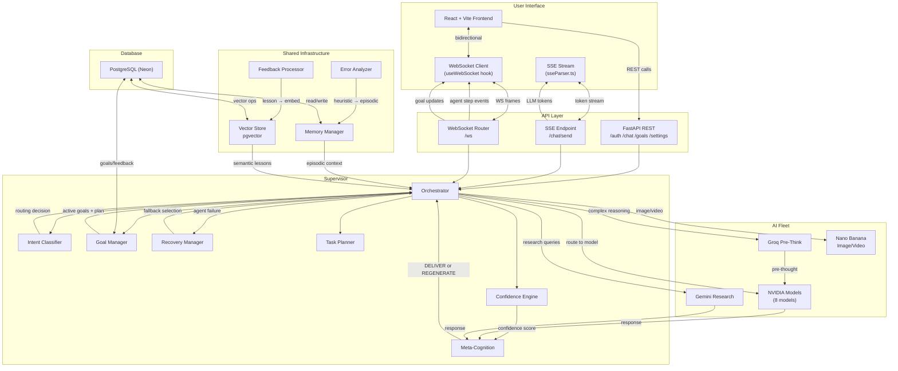
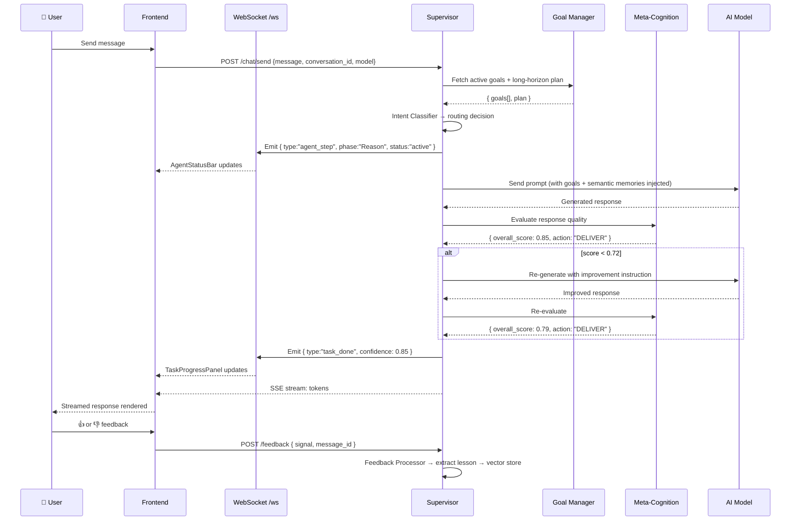
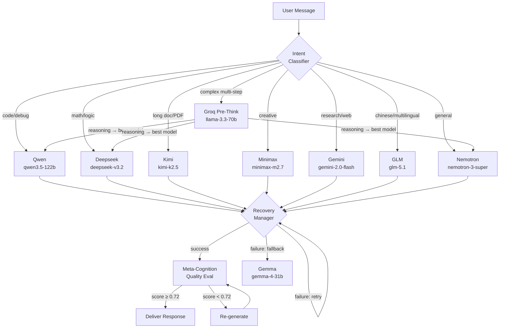
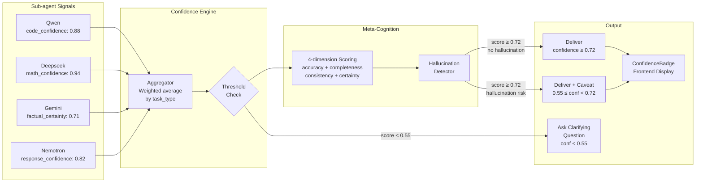

# Both AI — System Mindmap
## Complete Architecture, Data Flow, and Component Relationships

---

## 1. System Component Hierarchy

```mermaid
mindmap
  root((Both AI\nSuperintelligence))

    Supervisor Layer
      Orchestrator
        Intent Classifier
          Groq LLaMA Pre-Think
          Routing Rules Engine
          JSON Decision Output
        Task Planner
          Sub-task Decomposition
          Dependency Ordering
        Goal Manager
          Session Goal Persistence
          Sub-task Status Tracking
          Multi-session Continuity
          Auto-Replan on Failure
        Confidence Engine
          Per-agent Uncertainty Aggregation
          Clarify vs Proceed Threshold
          Escalation Ladder
        Meta-Cognition
          4-dimension Quality Scoring
          Hallucination Detection
          Re-generation Trigger
          Caveat Injection
        Recovery Manager
          Retry Logic
          Fallback Agent Selection
          Graceful Degradation
          User Notification

    AI Model Fleet
      NVIDIA Models
        Nemotron — General Chat
        Deepseek — Math Logic
        Qwen — Code Debug
        Kimi — Long Documents
        Minimax — Creative Writing
        GLM — Multilingual Chinese
        Gemma — Backup General
        Mistral — Fast Multilingual
      Google
        Gemini Flash — Research Image
      Groq
        LLaMA 3.3 70B — Pre-thinking
      External
        Nano Banana — Image Video

    Shared Infrastructure
      Memory System
        Episodic Memory
          JSONL Key-Value Store
          Session Context
          User Preferences
        Vector Store
          pgvector Embeddings
          Semantic Search top-k
          Lesson Retrieval
          Cosine Similarity
      Learning Pipeline
        Feedback Processor
          Signal Classification
          Lesson Extraction
          Vector Memory Write
        Error Analyzer
          Post-hoc Analysis
          Heuristic Generation
          Error Log Storage
        Lesson Extractor
          Prose Formatting
          Embeddable Text
      WebSocket Layer
        Agent Step Events
        Goal Update Events
        Task Progress Stream
        Abort Signal Handling

    Backend API
      Auth Router
        Register Login
        Google OAuth
        GitHub OAuth
        JWT Middleware
      Chat Router
        Send Message
        SSE Streaming
        History
        Incognito Mode
      Goals Router
        Create Update
        Sub-task Status
        Complete Archive
      Settings Router
        Language Preferences
        Profile Update
      Feedback Router
        Signal Submit
        Admin View
      Dashboard Router
        Stats Endpoint
        Xendit Withdraw
      WebSocket Router
        ws.py Endpoint
        Session Manager

    Frontend React Vite
      Pages
        Chat Interface
        Incognito Session
        Auth Login Register
        Onboarding 3-Step
        Dashboard Stats
      Components
        AgentStatusBar
          ReAct Phase Display
          WebSocket Consumer
        TaskProgressPanel
          Goal Progress
          Sub-task List
        ConfidenceBadge
          Score Display
          Dev Mode Only
        MemoryPanel
          Injected Memories
          Dev Mode Only
        AutonomyControl
          Supervised Mode
          Balanced Mode
          Autonomous Mode
        MessageBubble
          Markdown Rendering
          Code Highlighting
          Think Blocks
        Sidebar
          Conversation List
          Context Menu
        Topbar
          Model Selector
          New Chat Button
      Stores Zustand
        AuthStore
        ChatStore
        GoalStore
        UIStore
        I18nStore
      Hooks
        useAuth
        useChat
        useGoals
        useVoiceInput
        useWebSocket
      i18n
        11 Languages
        t() Function
        Auto-detection

    Database PostgreSQL Neon
      users
      user_profiles
      conversations
      messages
      memory key-value
      memory_vectors pgvector
      goals sub_tasks JSONB
      feedback signals
      error_logs heuristics
```

---

## 2. Data Flow Diagram



---

## 3. Agent Communication Protocol



---

## 4. Security Pipeline

```mermaid
flowchart LR
    subgraph "L1 — Network"
        TLS["TLS 1.3\nAll traffic encrypted"]
        CORS["CORS Policy\nAllowlist only"]
    end

    subgraph "L2 — Auth"
        JWT["JWT Validation\nHS256 + expiry check"]
        OAUTH["OAuth 2.0\nGoogle + GitHub"]
        RATE["Rate Limiting\n100 req/min/user"]
    end

    subgraph "L3 — Input"
        SAN["Input Sanitization\nXSS + injection strip"]
        TOK["Token Budget\nMax 8192 tokens/req"]
        FILE["File Type Validation\nAllowlist: pdf, png, jpg, txt"]
    end

    subgraph "L4 — Model"
        PMOD["Prompt Injection Guard\nSystem prompt isolation"]
        LEAK["Secret Leak Guard\nNo API keys in responses"]
        HARM["Harm Filter\nContent policy enforcement"]
    end

    subgraph "L5 — Data"
        ENC["DB Encryption at Rest\nNeon built-in"]
        PII["PII Scrubbing\nNo PII in memory_text"]
        AUDIT["Audit Logs\nAll admin actions logged"]
    end

    TLS --> CORS --> JWT --> OAUTH --> RATE
    RATE --> SAN --> TOK --> FILE
    FILE --> PMOD --> LEAK --> HARM
    HARM --> ENC --> PII --> AUDIT
```



---

## 5. Model Tier Routing



---

## 6. Feedback Learning Cycle *(New — GAP-05)*

```mermaid
flowchart TD
    U["👤 User"]
    SIG["Feedback Signal\n👍 / 👎 / Correction"]
    FP["feedback_processor.py\nClassify + Extract"]
    EA["error_analyzer.py\nPost-hoc Analysis"]
    LE["lesson_extractor.py\nFormat Prose"]
    EMB["Embedding Model\ntext-embedding-3-small"]
    VS["vector_store.py\nUpsert to pgvector"]
    DB[("memory_vectors\ntable")]
    SS["semantic_search\n(query, top_k=5)"]
    PB["prompt_builder.py\nInject Lessons"]
    LLM["LLM Response\n(improved)"]

    U --> SIG --> FP
    FP -->|"negative signal"| EA
    FP --> LE
    EA --> LE
    LE --> EMB --> VS --> DB
    DB --> SS --> PB --> LLM --> U

    style EA fill:#2a1a1a,stroke:#ff4d67
    style VS fill:#1a2a1a,stroke:#17c964
    style DB fill:#1a1a2a,stroke:#2d8cff
```



---

## 7. Confidence Propagation Flow *(New — GAP-04)*


