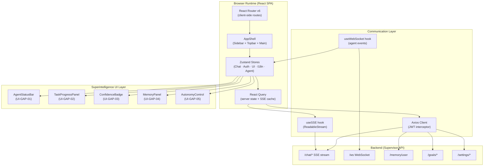

# Both AI — Frontend Architecture
## Superintelligence Autonomous AI — React + Vite SPA

---

## 1. Executive Summary

The Both AI Frontend is a **React 18 + Vite 5 SPA** — the sole user-facing layer of the Superintelligence system. It provides a premium dark-themed chat interface that orchestrates two backend sub-agents (Both (Coding) for coding, Both (General) for general intelligence) through a unified Supervisor API, fully invisible to the user.

| Aspect | Decision |
|---|---|
| **Foundation** | React 18 + Vite 5 (TypeScript) — fast HMR, tree-shaking, code splitting |
| **Architecture** | SPA with React Router v6 — all routes client-side |
| **State** | Zustand — lightweight global stores, no boilerplate |
| **Styling** | TailwindCSS — dark mode via `class` strategy, utility-first |
| **Animation** | Framer Motion — replaces CSS-only transitions |
| **API** | Axios + React Query (TanStack) — caching, SSE integration |
| **i18n** | i18next — replaces custom `TRANSLATIONS` object |
| **3D/Visual** | OGL (WebGL Orb), Monaco Editor (lazy-loaded) |

---

<!-- PATCH: §A — React + Vite Tech Stack -->
## §A. React + Vite Tech Stack

| Library | Version | Role |
|---|---|---|
| React | 18.x | UI component tree, hooks, Suspense |
| Vite | 5.x | Bundler — HMR, tree-shaking, code splitting |
| TypeScript | 5.x | Type safety across components and stores |
| React Router | v6 | Client-side routing, `<ProtectedRoute>` guard |
| Zustand | 4.x | Global state: ChatStore, AuthStore, UIStore, I18nStore, AgentStore |
| TailwindCSS | 3.x | Utility-first styling, dark mode via `class` |
| Framer Motion | 11.x | Page transitions, overlay animations, micro-interactions |
| Axios | 1.x | HTTP client with JWT interceptors |
| React Query | 5.x | Server state, cache, SSE stream integration |
| i18next | 23.x | i18n — 11 languages, namespace-based keys |
| Monaco Editor | 0.46.x | Lazy-loaded code editor for Both Code |
| OGL | 1.x | WebGL Orb renderer (minimal WebGL library) |
| marked.js | 12.x | Markdown parser for assistant messages |
| highlight.js | 11.x | Code syntax highlighting |

### Vite Build Configuration
```typescript
// vite.config.ts — key settings
export default defineConfig({
  plugins: [react()],
  build: {
    rollupOptions: {
      output: {
        manualChunks: {
          vendor: ['react', 'react-dom', 'react-router-dom'],
          ui: ['framer-motion', '@tanstack/react-query'],
          i18n: ['i18next', 'react-i18next'],
          // Monaco is lazy-loaded: import('./MonacoEditor')
        }
      }
    }
  }
});
```

---

## 2. High-Level Architecture



---

## 3. Component Hierarchy

### 3.1 App Shell (Persistent)

```
AppShell (AppShell.tsx)
├── Sidebar (Sidebar.tsx — collapsible: 68px / 260px)
│   ├── ConversationList.tsx (grouped: Today/Yesterday/Older)
│   │   └── ConversationItem (title + context menu)
│   ├── MemoryPanel.tsx [UI-GAP-04] ← memory icon in nav
│   └── UserProfile.tsx (avatar + dropdown)
├── Topbar (Topbar.tsx)
│   ├── HamburgerToggle
│   ├── ModelSelector (dropdown)
│   ├── AutonomyControl.tsx [UI-GAP-05] (compact topbar variant)
│   └── NewChatButton
└── MainContent (page-specific, React Router Outlet)
```

### 3.2 Chat Interface (ChatPage.tsx)

```
ChatPage
├── AgentStatusBar.tsx [UI-GAP-01]  ← above thread, below Topbar
├── WelcomeScreen.tsx (shown when messages.length === 0)
│   ├── WebGLOrb (OGL canvas)
│   ├── GreetingText (time-based)
│   └── SuggestionCards[]
├── MessageThread.tsx (scrollable)
│   ├── MessageBubble.tsx[user]
│   │   └── Content + Timestamp
│   ├── MessageBubble.tsx[assistant]
│   │   ├── MarkdownRenderer (marked.js)
│   │   ├── CodeBlock.tsx (highlight.js + copy)
│   │   ├── ThinkBlock.tsx (collapsible)
│   │   ├── ConfidenceBadge.tsx [UI-GAP-03]
│   │   └── ActionBar (copy · regenerate · 👍👎)
│   └── TypingIndicator.tsx
├── TaskProgressPanel.tsx [UI-GAP-02] ← inline, collapsible
└── Composer.tsx
    ├── AttachmentPreview (file chips)
    ├── AutoResizeTextArea
    └── ToolBar (attach · voice · extended · send)
```

### 3.3 Auth Pages

```
LoginPage.tsx → /login
RegisterPage.tsx → /register
OAuthCallback.tsx → /auth/callback
OnboardingWizard.tsx → /onboarding
  ├── StepName.tsx
  ├── StepTopics.tsx
  └── StepLanguage.tsx
```

### 3.4 Settings Modal

```
SettingsModal.tsx (overlay, Framer Motion AnimatePresence)
├── ProfileTab.tsx
├── LanguageTab.tsx (11-language grid)
├── InterfaceTab.tsx
│   └── AutonomyControl.tsx [UI-GAP-05] ← full settings variant
├── ChatTab.tsx (archive/delete/import/export)
├── FAQTab.tsx
└── AboutTab.tsx
```

---

<!-- PATCH: §B — Superintelligence UI Layer -->
## §B. Superintelligence UI Layer

### UI-GAP-01: AgentStatusBar

**File:** `src/components/chat/AgentStatusBar.tsx`
**Visibility:** Chat page only; hidden in IncognitoPage

**Props Interface:**
```typescript
interface AgentStatusBarProps {
  isVisible: boolean;        // fades out when no task running
  activeAgent: 'Supervisor' | 'Both (Coding)' | 'Both (General)' | null;
  currentAction: string;     // e.g. "routing..." / "executing code..."
  stepCurrent: number;       // e.g. 3
  stepTotal: number;         // e.g. 7 (0 = single-step)
  onAbort: () => void;       // sends {"type":"abort"} via WebSocket
}
```

**State Source:** `AgentStore.activeAgent`, `AgentStore.currentAction`, `AgentStore.taskProgress`
**WebSocket Binding:** Subscribes to `agent_step` events from `api/routers/ws.py`
**Behavior:** Framer Motion `AnimatePresence` fade-in/out; abort button sends WS message

---

### UI-GAP-02: TaskProgressPanel

**File:** `src/components/chat/TaskProgressPanel.tsx`
**Trigger:** Appears when backend sends `task_decomposed` WS event

**Props Interface:**
```typescript
interface TaskProgressPanelProps {
  taskTree: TaskNode[];      // parent task + sub-tasks
  isCollapsed: boolean;
  onToggle: () => void;
}

interface TaskNode {
  id: string;
  label: string;
  agent: 'Both (Coding)' | 'Both (General)';
  status: 'pending' | 'in_progress' | 'done' | 'failed';
  children?: TaskNode[];
}
```

**State Source:** `AgentStore.taskTree`
**Backend Reference:** Data from `supervisor/task_planner.py` via WebSocket
**Behavior:** Auto-collapses after all sub-tasks reach `done`; overall progress bar

---

### UI-GAP-03: ConfidenceBadge

**File:** `src/components/chat/ConfidenceBadge.tsx`
**Placement:** Below message timestamp on every assistant `MessageBubble`

**Props Interface:**
```typescript
interface ConfidenceBadgeProps {
  score: number;             // 0.0–1.0
  agent: string;             // which agent answered
  model: string;             // model used
  routingReason?: string;    // tooltip content
}
// Derived:
// score >= 0.85 → "high"  → green dot
// 0.60–0.84    → "medium" → yellow dot
// < 0.60       → "low"   → red dot + warning text
```

**State Source:** `confidence` field in SSE payload from `supervisor/confidence_engine.py`
**Design:** Non-intrusive — `● 94%` small text; Framer tooltip on hover

---

### UI-GAP-04: MemoryPanel

**File:** `src/components/sidebar/MemoryPanel.tsx`
**Access:** Sidebar nav icon (brain icon) → slide-out panel

**Props Interface:**
```typescript
interface MemoryPanelProps {
  isOpen: boolean;
  onClose: () => void;
}
// Internal state from React Query:
// GET /memory/user → MemoryItem[]
interface MemoryItem {
  id: string;
  type: 'topic' | 'correction' | 'key_fact' | 'language';
  content: string;
  created_at: string;
}
```

**Backend Reference:** Reads from `shared/memory/vector_store.py` via `GET /memory/user`
**Mutations:** `DELETE /memory/user/{id}` per item (optimistic update via React Query)
**Actions:** "Clear all memory" button → confirmation dialog → `DELETE /memory/user/all`

---

### UI-GAP-05: AutonomyControl

**File:** `src/components/settings/AutonomyControl.tsx`
**Variants:** Full (InterfaceTab) + Compact (Topbar dropdown)

**Props Interface:**
```typescript
interface AutonomyControlProps {
  variant: 'full' | 'compact';
}
// Levels:
// 0 = "Always ask"     — confirm before every agent action
// 1 = "Ask on ambiguity" — proceed unless task is unclear
// 2 = "Fully autonomous" — execute without confirmation
```

**State Source:** `UIStore.autonomyLevel` (Zustand)
**API Sync:** `PATCH /settings/autonomy { level: 0|1|2 }` on change
**Backend Reference:** Syncs with `supervisor/goal_manager.py` autonomy level field
**Persistence:** `UIStore` → `localStorage['both_autonomy']` + API

---

<!-- PATCH: §C — WebSocket Integration -->
## §C. WebSocket Integration

### Connection Setup (`src/api/ws.ts`)

```typescript
// Connects to backend api/routers/ws.py
const WS_URL = `${import.meta.env.VITE_WS_URL}/ws`;

export function createWsConnection(token: string): WebSocket {
  const ws = new WebSocket(`${WS_URL}?token=${token}`);
  ws.onmessage = (e) => dispatchWsEvent(JSON.parse(e.data));
  return ws;
}
```

### Event Types Received from `ws.py`

| Event Type | Payload Fields | UI Consumer |
|---|---|---|
| `agent_step` | `phase, status, detail` | `AgentStatusBar` |
| `task_decomposed` | `taskTree: TaskNode[]` | `TaskProgressPanel` |
| `task_progress` | `taskId, status, progress` | `TaskProgressPanel` |
| `goal_update` | `goal_id, status, progress` | `TaskProgressPanel` |
| `task_done` | `result, confidence` | `AgentStore`, `ConfidenceBadge` |
| `recovery` | `action, agent, reason` | Toast notification |
| `agent_error` | `error, detail` | Toast + `AgentStatusBar` |
| `heartbeat` | `timestamp` | `useWebSocket` keep-alive |

### Event → Store Mapping

```typescript
// src/hooks/useWebSocket.ts
function dispatchWsEvent(event: WsEvent) {
  const { setActiveAgent, setTaskTree, setTaskProgress } = useAgentStore.getState();
  switch (event.type) {
    case 'agent_step':      setActiveAgent(event.phase, event.detail); break;
    case 'task_decomposed': setTaskTree(event.taskTree); break;
    case 'task_progress':   setTaskProgress(event.taskId, event.status); break;
    case 'task_done':       setActiveAgent(null, null); break;
    case 'recovery':        toast.warn(`Switched to ${event.agent}: ${event.reason}`); break;
  }
}
```

---

<!-- PATCH: §D — State Architecture (Zustand) -->
## §D. State Architecture — Zustand Store Map

All state is managed via **Zustand**. localStorage is used only for persistence hydration on refresh.

### Store Overview

| Store | File | Manages |
|---|---|---|
| `ChatStore` | `stores/chatStore.ts` | conversations, messages, streaming state, SSE abort |
| `AuthStore` | `stores/authStore.ts` | user, JWT token, OAuth provider, session |
| `UIStore` | `stores/uiStore.ts` | sidebar, modals, theme, autonomyLevel, widescreen |
| `I18nStore` | `stores/i18nStore.ts` | current language, i18next instance |
| `AgentStore` *(new)* | `stores/agentStore.ts` | activeAgent, currentAction, taskTree, confidenceMap, wsConnection |

### AgentStore Definition (New)

```typescript
// src/stores/agentStore.ts
interface AgentState {
  // Active agent tracking
  activeAgent: 'Supervisor' | 'Both (Coding)' | 'Both (General)' | null;
  currentAction: string | null;      // "routing..." / "executing code..."
  stepCurrent: number;
  stepTotal: number;

  // Task decomposition
  taskTree: TaskNode[];
  taskVisible: boolean;

  // Confidence tracking (keyed by message ID)
  confidenceMap: Record<string, number>;

  // WebSocket
  wsConnection: WebSocket | null;
  wsConnected: boolean;

  // Actions
  setActiveAgent: (agent: AgentState['activeAgent'], action: string | null) => void;
  setTaskTree: (tree: TaskNode[]) => void;
  setTaskProgress: (taskId: string, status: TaskNode['status']) => void;
  setConfidence: (messageId: string, score: number) => void;
  setWsConnection: (ws: WebSocket) => void;
  abortTask: (taskId: string) => void;
}
```

### Persistence Strategy

| Data | Storage | Key |
|---|---|---|
| JWT Token | `localStorage` | `both_token` |
| Language | `localStorage` | `both_language` |
| UI Toggles | `localStorage` | `both_ui_*` |
| Autonomy Level | `localStorage` + API | `both_autonomy` |
| Chat History | PostgreSQL | server-side |
| Agent / Task State | In-memory (AgentStore) | Session-scoped |
| Incognito Messages | In-memory only | Until tab close |

---

## 4. API Integration Map

### Core Endpoints

| Category | Method | Endpoint | Hook / Consumer |
|---|---|---|---|
| **Auth** | POST | `/auth/login` | `useAuth.ts` |
| | POST | `/auth/register` | `useAuth.ts` |
| | POST | `/auth/google` | `OAuthCallback.tsx` |
| | POST | `/auth/github` | `OAuthCallback.tsx` |
| | GET | `/auth/me` | `AuthStore` hydration |
| **Chat** | POST | `/chat/` | `useChat.ts` → SSE stream |
| | GET | `/chat/history` | `ChatStore` |
| | GET | `/chat/{id}` | `ChatStore` |
| | PUT | `/chat/{id}/rename` | context menu |
| | POST | `/chat/{id}/archive` | context menu |
| | POST | `/chat/archive-all` | ChatTab settings |
| | DELETE | `/chat/delete-all` | ChatTab settings |
| **Settings** | GET | `/settings/` | `SettingsModal` |
| | PUT | `/settings/profile` | `ProfileTab` |
| | PUT | `/settings/language` | `LanguageTab` |
| | PATCH | `/settings/autonomy` | `AutonomyControl` *(GAP-05)* |
| **Onboarding** | POST | `/onboarding/` | `OnboardingWizard` |
| **Feedback** | POST | `/feedback/` | `ActionBar` (👍/👎) |
| **Goals** | GET | `/goals/` | `AgentStore` |
| | POST | `/goals/` | Supervisor auto-create |
| **Memory** | GET | `/memory/user` | `MemoryPanel` *(GAP-04)* |
| | DELETE | `/memory/user/{id}` | `MemoryPanel` delete item |
| | DELETE | `/memory/user/all` | `MemoryPanel` clear all |
| **Dashboard** | GET | `/dashboard/` | `DashboardPage` |
| **WebSocket** | WS | `/ws` | `useWebSocket.ts` *(GAP-08)* |

### SSE Stream Protocol

```
POST /chat/ → text/event-stream

data: {"token": "Hello"}
data: {"token": " world", "confidence": 0.91}   ← confidence injected here
data: {"thinking": "<think>reasoning...</think>"}
data: {"conversation_id": "abc", "title": "Auto Title"}
data: [DONE]
```

The `confidence` field in the stream payload is parsed by `useConfidence.ts` and stored in `AgentStore.confidenceMap[messageId]`, consumed by `ConfidenceBadge`.

---

## 5. Rendering Strategy

### React Component Rendering

All UI is rendered via **React JSX components** with:
- `useState` / `useReducer` for local UI state
- Zustand stores for shared global state
- React Query for async server state with caching
- Framer Motion `AnimatePresence` for enter/exit animations

### Markdown Pipeline

```
Raw SSE tokens → React state buffer
  → ThinkBlock extractor (<think>...</think>)
  → marked.js (markdown → HTML string)
  → highlight.js (code block syntax)
  → dangerouslySetInnerHTML (sanitized via DOMPurify)
  → Copy button attached via useEffect ref
```

### WebGL Orb Pipeline

```
OGL (WebGL) → requestAnimationFrame loop
  → Vertex shader: noise sphere displacement
  → Fragment shader: animated gradient (#6c63ff → #00d4aa)
  → Hidden when messages.length > 0 (Framer Motion fade)
  → Paused when document.hidden (IntersectionObserver)
  → prefers-reduced-motion → static gradient fallback
```

---

## 6. i18n System (i18next)

| Component | Description |
|---|---|
| `i18next` instance | Configured in `src/i18n/index.ts` |
| `useTranslation()` hook | Per-component translation access |
| Namespaces | `common`, `chat`, `settings`, `onboarding`, `errors` |
| Language detection | `i18next-browser-languagedetector` on first visit |
| Persistence | `localStorage['both_language']` |

### Supported Languages

| Code | Language | RTL | Voice |
|---|---|---|---|
| `en` | English | No | `en-US` |
| `id` | Bahasa Indonesia | No | `id-ID` |
| `ja` | 日本語 | No | `ja-JP` |
| `ko` | 한국어 | No | `ko-KR` |
| `zh` | 中文 | No | `zh-CN` |
| `fr` | Français | No | `fr-FR` |
| `de` | Deutsch | No | `de-DE` |
| `it` | Italiano | No | `it-IT` |
| `pt` | Português (BR) | No | `pt-BR` |
| `es` | Español | No | `es-ES` |
| `ar` | العربية | **Yes** | `ar-SA` |

---

## 7. Security Model (Frontend)

| Threat | Mitigation |
|---|---|
| XSS via chat | `DOMPurify` sanitizes marked.js output before `dangerouslySetInnerHTML` |
| Token theft | JWT in `localStorage`; HTTPS enforced; short expiry (24h) |
| CSRF | Bearer token auth — no cookies; inherently CSRF-resistant |
| WS hijack | JWT validated in WS handshake by `ws.py` |
| Prompt injection in UI | Input sanitized before API send |
| Incognito data leak | Zero localStorage writes; all state in-memory Zustand |

---

## 8. Performance Budget

| Metric | Target |
|---|---|
| First Contentful Paint | < 1.2s |
| Largest Contentful Paint | < 2.0s |
| Total JS Bundle (gzipped) | < 300KB (excl. Monaco lazy chunk) |
| Monaco Editor chunk | < 2MB (lazy-loaded only on Both Code page) |
| Lighthouse Score | ≥ 90 all categories |
| WebGL Orb FPS | ≥ 30 |

**Optimization strategies:**
- `React.lazy()` + `Suspense` for all page components and Monaco
- `manualChunks` in Vite for vendor splitting
- React Query stale-time caching for conversation history
- Framer Motion `useReducedMotion()` for accessibility

---

## 9. Route Map

| Route | Component | Auth | Description |
|---|---|---|---|
| `/` | redirect | — | → `/chat` or `/login` |
| `/login` | `LoginPage` | ❌ | Google + GitHub OAuth |
| `/register` | `RegisterPage` | ❌ | New account |
| `/auth/callback` | `OAuthCallback` | ❌ | OAuth token exchange |
| `/onboarding` | `OnboardingWizard` | ✅ | 3-step first-time setup |
| `/chat` | `ChatPage` | ✅ | Primary chat interface |
| `/chat/:id` | `ChatPage` | ✅ | Specific conversation |
| `/incognito` | `IncognitoPage` | ❌ | Private session |
| `/dashboard` | `DashboardPage` | ✅ | Stats + monetization |

---

## 10. Accessibility Targets

| Requirement | Implementation |
|---|---|
| WCAG 2.1 AA | Minimum target |
| Keyboard navigation | All interactive elements focusable; Tab order logical |
| Screen reader | `aria-label` on icon buttons; `role="alert"` on toasts |
| Color contrast | ≥ 4.5:1 on all text |
| Focus indicators | 2px solid `--accent-primary` |
| Motion reduction | `useReducedMotion()` disables Framer Motion + Orb |
| RTL layout | Arabic locale flips layout via TailwindCSS `dir="rtl"` |
