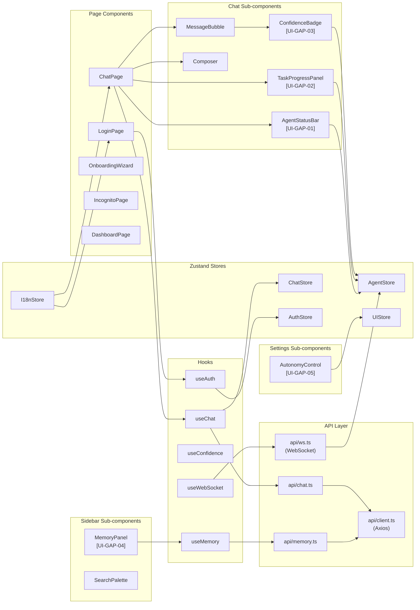

# Both AI — Frontend File Structure
## React + Vite SPA — Production Directory Layout

---

## Root Directory Tree

```
both-ai/
├── frontend/                          ← Vite root
│   ├── index.html                     ← SPA entry point (injects <div id="root">)
│   ├── vite.config.ts                 ← Bundler config (manualChunks, aliases)
│   ├── tsconfig.json                  ← TypeScript strict mode
│   ├── postcss.config.js              ← PostCSS for Tailwind
│   ├── tailwind.config.ts             ← Tailwind design tokens (colors, spacing, radius)
│   ├── .env.example                   ← VITE_API_URL, VITE_WS_URL, VITE_APP_ENV
│   ├── public/
│   │   ├── assets/
│   │   │   ├── fonts/                 ← Self-hosted Google Fonts (Inter, JetBrains Mono)
│   │   │   ├── icons/                 ← SVG icon files
│   │   │   └── images/                ← OG image, brand assets
│   │   ├── favicon.ico
│   │   └── manifest.json              ← PWA manifest
│   └── src/
│       ├── main.tsx                   ← React root mount + QueryClientProvider
│       ├── App.tsx                    ← Router + AppShell + auth guard
│       ├── router.tsx                 ← React Router v6 route definitions
│       │
│       ├── api/                       ← HTTP + WebSocket clients
│       │   ├── client.ts              ← Axios instance + JWT interceptor
│       │   ├── ws.ts                  ← WebSocket factory + event dispatcher
│       │   ├── chat.ts                ← Chat endpoint wrappers (SSE + REST)
│       │   ├── auth.ts                ← Auth endpoint wrappers
│       │   ├── settings.ts            ← Settings endpoint wrappers
│       │   ├── goals.ts               ← Goals endpoint wrappers [GAP-03]
│       │   ├── memory.ts              ← Memory endpoint wrappers [GAP-04]
│       │   └── feedback.ts            ← Feedback endpoint wrappers [GAP-05]
│       │
│       ├── stores/                    ← Zustand global state
│       │   ├── chatStore.ts           ← conversations, messages, streaming, SSE abort
│       │   ├── authStore.ts           ← user, token, provider, session
│       │   ├── uiStore.ts             ← sidebar, modals, theme, autonomyLevel, widescreen
│       │   ├── i18nStore.ts           ← language, i18next instance
│       │   └── agentStore.ts          ← [NEW] activeAgent, taskTree, confidenceMap, wsConnection [UI-GAP-01/02/03]
│       │
│       ├── hooks/                     ← Custom React hooks
│       │   ├── useChat.ts             ← Send message + SSE stream orchestration
│       │   ├── useSSE.ts              ← Generic ReadableStream/SSE parser
│       │   ├── useWebSocket.ts        ← WS connection + event dispatch to AgentStore [UI-GAP-01/02]
│       │   ├── useAuth.ts             ← Login/logout/OAuth + AuthStore
│       │   ├── useConfidence.ts       ← Extract confidence from SSE payload → AgentStore [UI-GAP-03]
│       │   ├── useMemory.ts           ← React Query wrapper for /memory/user [UI-GAP-04]
│       │   ├── useVoiceInput.ts       ← Web Speech API voice recording
│       │   └── useKeyboardShortcuts.ts← Cmd+K, Cmd+Shift+N, Esc
│       │
│       ├── components/                ← All UI components
│       │   │
│       │   ├── shell/                 ← Persistent layout components
│       │   │   ├── AppShell.tsx       ← Root flex layout: Sidebar + Outlet
│       │   │   ├── Sidebar.tsx        ← Collapsible 68px/260px, Framer Motion
│       │   │   ├── Topbar.tsx         ← Hamburger + ModelSelector + NewChatButton
│       │   │   ├── ConversationList.tsx← Grouped conversation items
│       │   │   ├── ConversationItem.tsx← Title + context menu
│       │   │   └── UserProfile.tsx    ← Avatar + dropdown menu
│       │   │
│       │   ├── chat/                  ← Chat interface components
│       │   │   ├── ChatPage.tsx       ← Route page: composes all chat children
│       │   │   ├── WelcomeScreen.tsx  ← WebGL Orb + greeting + suggestion cards
│       │   │   ├── WebGLOrb.tsx       ← OGL renderer, vertex/fragment shaders
│       │   │   ├── MessageThread.tsx  ← Scrollable message list + auto-scroll
│       │   │   ├── MessageBubble.tsx  ← User + assistant variants
│       │   │   ├── MarkdownRenderer.tsx← marked.js + DOMPurify + highlight.js
│       │   │   ├── CodeBlock.tsx      ← Syntax highlight + copy button + language tag
│       │   │   ├── ThinkBlock.tsx     ← Collapsible <think> reasoning panel
│       │   │   ├── ActionBar.tsx      ← Copy + Regenerate + 👍👎 + branch selector
│       │   │   ├── TypingIndicator.tsx← Three-dot pulse animation
│       │   │   ├── Composer.tsx       ← Auto-resize textarea + toolbar
│       │   │   ├── FileAttachment.tsx ← File chip preview + remove
│       │   │   ├── SuggestionCards.tsx← Welcome screen prompt suggestions
│       │   │   ├── AgentStatusBar.tsx ← [UI-GAP-01] Agent phase bar + abort button
│       │   │   ├── TaskProgressPanel.tsx← [UI-GAP-02] Task tree + sub-task status
│       │   │   └── ConfidenceBadge.tsx← [UI-GAP-03] Score dot + tooltip on messages
│       │   │
│       │   ├── sidebar/               ← Sidebar panel components
│       │   │   ├── MemoryPanel.tsx    ← [UI-GAP-04] Slide-out memory browser
│       │   │   ├── MemoryItem.tsx     ← Individual memory entry + delete
│       │   │   └── SearchPalette.tsx  ← Cmd+K fuzzy search overlay
│       │   │
│       │   ├── settings/              ← Settings modal components
│       │   │   ├── SettingsModal.tsx  ← Framer Motion overlay + tabbed layout
│       │   │   ├── ProfileTab.tsx     ← Avatar upload + display name
│       │   │   ├── LanguageTab.tsx    ← 11-language grid
│       │   │   ├── InterfaceTab.tsx   ← 8 toggles + AutonomyControl (full)
│       │   │   ├── ChatTab.tsx        ← Archive/delete/import/export
│       │   │   ├── FAQTab.tsx         ← Accordion FAQ items
│       │   │   ├── AboutTab.tsx       ← Version + credits + links
│       │   │   └── AutonomyControl.tsx← [UI-GAP-05] Level 0/1/2 selector (full + compact)
│       │   │
│       │   ├── auth/                  ← Auth page components
│       │   │   ├── LoginPage.tsx      ← Google + GitHub OAuth + email/password
│       │   │   ├── RegisterPage.tsx   ← New account creation
│       │   │   ├── OAuthCallback.tsx  ← /auth/callback handler
│       │   │   └── OnboardingWizard.tsx← 3-step wizard: Name, Topics, Language
│       │   │
│       │   ├── incognito/             ← Incognito mode
│       │   │   ├── IncognitoPage.tsx  ← Full-page private session (no sidebar)
│       │   │   └── IncognitoHeader.tsx← Mask icon + session badge + exit
│       │   │
│       │   ├── dashboard/             ← Developer dashboard
│       │   │   └── DashboardPage.tsx  ← Stats + Xendit withdraw
│       │   │
│       │   └── common/                ← Shared UI primitives
│       │       ├── Toast.tsx          ← Notification queue (Framer AnimatePresence)
│       │       ├── Modal.tsx          ← Generic modal wrapper + backdrop
│       │       ├── ConfirmDialog.tsx  ← Destructive action confirmation
│       │       ├── Skeleton.tsx       ← Loading skeleton placeholder
│       │       ├── ErrorBoundary.tsx  ← React error boundary
│       │       ├── ProtectedRoute.tsx ← Auth guard HOC
│       │       └── Avatar.tsx         ← User/Both avatar with fallback
│       │
│       ├── i18n/                      ← Internationalization
│       │   ├── index.ts               ← i18next init + language detector
│       │   └── locales/               ← Translation JSON files
│       │       ├── en.json
│       │       ├── id.json
│       │       ├── ja.json
│       │       ├── ko.json
│       │       ├── zh.json
│       │       ├── fr.json
│       │       ├── de.json
│       │       ├── it.json
│       │       ├── pt.json
│       │       ├── es.json
│       │       └── ar.json
│       │
│       ├── styles/                    ← Global CSS
│       │   ├── globals.css            ← CSS custom properties (design tokens)
│       │   ├── animations.css         ← Shared Framer Motion variant definitions
│       │   └── markdown.css           ← Prose styling for MarkdownRenderer output
│       │
│       ├── utils/                     ← Pure utility functions
│       │   ├── markdown.ts            ← marked.js + highlight.js + DOMPurify pipeline
│       │   ├── date.ts                ← Relative time formatting (conversation grouping)
│       │   ├── storage.ts             ← localStorage read/write helpers + dual-key compat
│       │   ├── cn.ts                  ← TailwindCSS `clsx` + `twMerge` utility
│       │   └── constants.ts           ← App-wide constants (AUTONOMY_LEVELS, SSE_DONE etc.)
│       │
│       └── types/                     ← Shared TypeScript interfaces
│           ├── api.ts                 ← API request/response shapes
│           ├── chat.ts                ← Message, Conversation, SSEPayload types
│           ├── agent.ts               ← TaskNode, WsEvent, AgentPhase types [UI-GAP-01/02]
│           ├── auth.ts                ← User, AuthToken, OAuthProvider types
│           └── settings.ts            ← Settings, UIToggle, AutonomyLevel types [UI-GAP-05]
```

---

<!-- PATCH: §A — React+Vite specific structural decisions -->
## §A. Key File Decisions

| File | Reason for Decision |
|---|---|
| `router.tsx` (separate) | Keeps `App.tsx` clean; router.tsx exports `<RouterProvider>` |
| `api/ws.ts` (separate from client.ts) | WebSocket and HTTP are different protocols; avoids interceptor entanglement |
| `stores/agentStore.ts` (new file) | Agent state is large enough to warrant its own store; separate from UIStore |
| `hooks/useWebSocket.ts` | Abstracts WS lifecycle (connect, reconnect, heartbeat) from components |
| `hooks/useConfidence.ts` | SSE payload parsing isolated from rendering logic |
| `components/common/` | Shared primitives (Toast, Modal) — used across multiple page components |
| `utils/storage.ts` | Dual-key localStorage compat: reads `both_*` first, falls back to `both_general_*` during transition |
| `types/agent.ts` (new file) | TaskNode and WsEvent types used by 3+ components — centralized |

---

## §B. Module Dependency Graph



---

## §C. New Files vs Migrated Files

### New Files (React/Vite — do not exist in legacy)

| File | Type | Notes |
|---|---|---|
| `src/router.tsx` | New | React Router v6 definition |
| `src/stores/agentStore.ts` | New | UI-GAP-01/02/03 |
| `src/hooks/useWebSocket.ts` | New | WS hook for agent events |
| `src/hooks/useSSE.ts` | New | SSE parser hook |
| `src/hooks/useConfidence.ts` | New | SSE confidence parser |
| `src/hooks/useMemory.ts` | New | React Query wrapper |
| `src/api/ws.ts` | New | WebSocket client |
| `src/api/goals.ts` | New | Goals API wrapper |
| `src/api/memory.ts` | New | Memory API wrapper |
| `src/api/feedback.ts` | New | Feedback API wrapper |
| `src/components/chat/AgentStatusBar.tsx` | New | UI-GAP-01 |
| `src/components/chat/TaskProgressPanel.tsx` | New | UI-GAP-02 |
| `src/components/chat/ConfidenceBadge.tsx` | New | UI-GAP-03 |
| `src/components/sidebar/MemoryPanel.tsx` | New | UI-GAP-04 |
| `src/components/settings/AutonomyControl.tsx` | New | UI-GAP-05 |
| `src/components/common/Toast.tsx` | New | Framer Motion queue |
| `src/components/common/ErrorBoundary.tsx` | New | React error boundary |
| `src/types/agent.ts` | New | WsEvent + TaskNode types |
| `src/utils/cn.ts` | New | clsx + twMerge |
| `src/styles/animations.css` | New | Framer Motion variants |

### Migrated Files (legacy vanilla JS → React)

| Legacy File | React Equivalent |
|---|---|
| `chat.js` | `stores/chatStore.ts` + `hooks/useChat.ts` |
| `auth.js` | `stores/authStore.ts` + `hooks/useAuth.ts` |
| `ui.js` | `stores/uiStore.ts` |
| `i18n.js` (TRANSLATIONS) | `i18n/index.ts` + `i18n/locales/*.json` |
| `markdown.js` | `utils/markdown.ts` |
| `sidebar.js` | `components/shell/Sidebar.tsx` |
| `composer.js` | `components/chat/Composer.tsx` |
| `voice.js` | `hooks/useVoiceInput.ts` |
| `settings.js` | `components/settings/SettingsModal.tsx` + tabs |
| `orb.js` | `components/chat/WebGLOrb.tsx` |
| `api.js` | `api/client.ts` + all `api/*.ts` wrappers |

---

## §D. localStorage Key Compatibility

During transition from Both → Both, `utils/storage.ts` implements dual-key reading:

```typescript
// utils/storage.ts
export function storageGet(key: string): string | null {
  // Try new both_ key first; fall back to legacy both_general_ key
  return localStorage.getItem(`both_${key}`) 
      ?? localStorage.getItem(`both_general_${key}`) 
      ?? null;
}

export function storageSet(key: string, value: string): void {
  // Always write to new key; remove legacy key to avoid stale data
  localStorage.setItem(`both_${key}`, value);
  localStorage.removeItem(`both_general_${key}`);
}
```

**Keys migrated:**

| Legacy Key | New Key |
|---|---|
| `both_general_token` | `both_token` |
| `both_general_language` | `both_language` |
| `both_general_ui_sidebar` | `both_ui_sidebar` |
| `both_general_ui_widescreen` | `both_ui_widescreen` |
| — | `both_autonomy` *(new)* |

---

## §E. Environment Variables

```env
# .env.example (frontend)
VITE_API_URL=http://localhost:8000        # Backend base URL
VITE_WS_URL=ws://localhost:8000          # WebSocket base (separate for Fly.io in prod)
VITE_APP_ENV=development                 # "development" | "production"
VITE_ENABLE_AGENT_STORE=true             # Feature flag: AgentStore + UI-GAP components
VITE_SENTRY_DSN=                         # Error tracking (optional)
```
