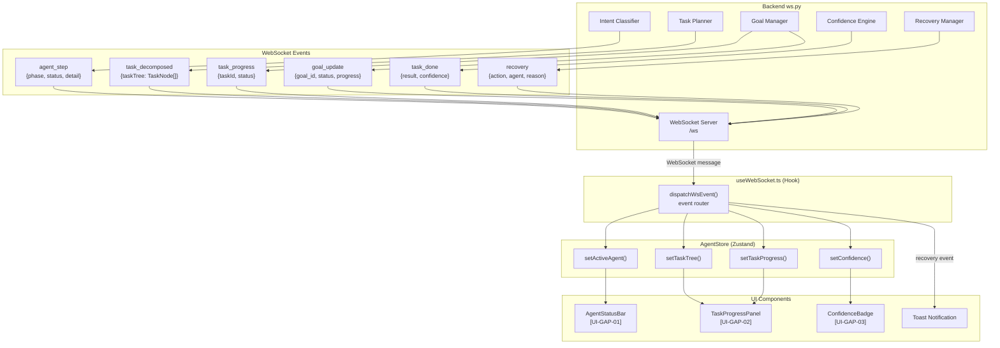
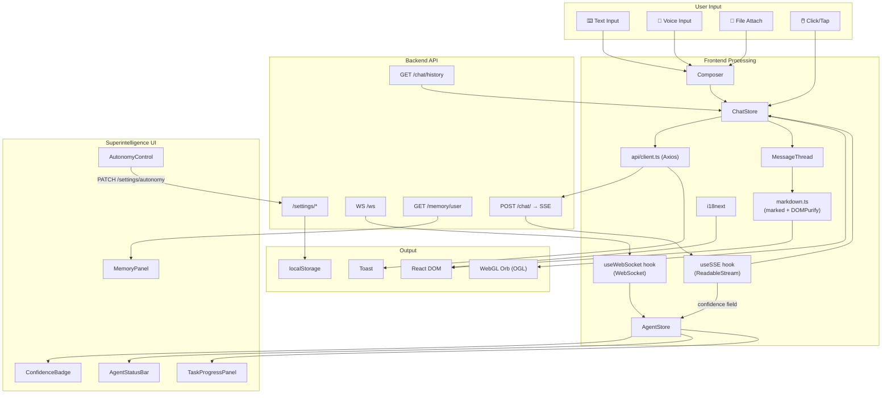
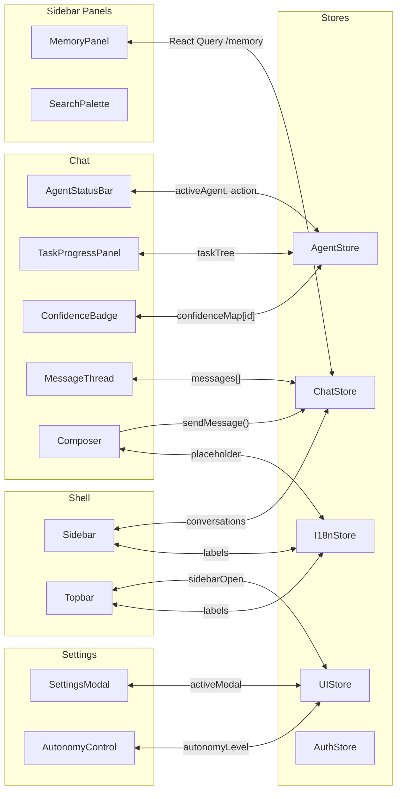
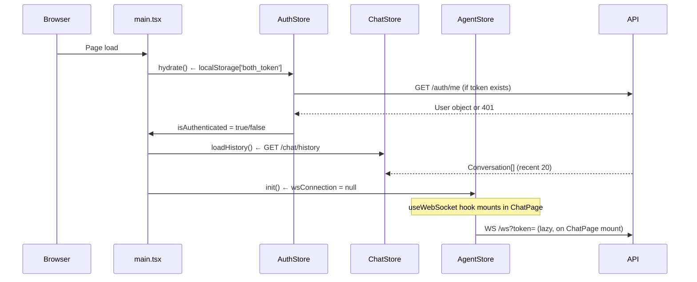
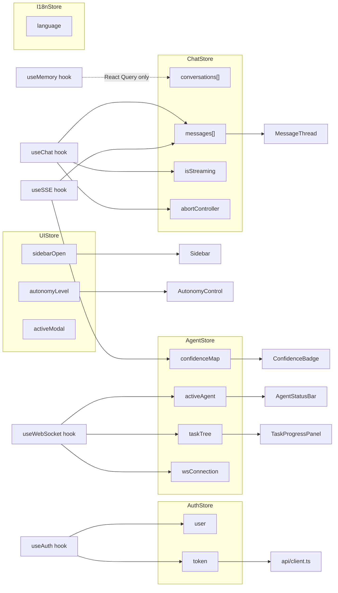

# Both AI — Frontend Mindmap
## React + Vite SPA — Complete UI Component & Feature Map

---

## System Mindmap

```mermaid
mindmap
  root((Both AI Frontend))

    App Shell
      Sidebar
        Navigation Icons
          Home
          Search
          History
          MemoryPanel Icon
          Feedback
        Conversation List
          Grouped Headers
            Today
            Yesterday
            Previous 7 Days
            Older
          ConversationItem
            Title
            Context Menu
              Rename
              Archive
          Search Filter
        UserProfile
          Avatar Badge
          Profile Name
          Dropdown Menu
            Profile Settings
            Language
            FAQ
            Logout
      Topbar
        Hamburger Toggle
        Model Selector
        AutonomyControl Compact
        New Chat Button
        Conversation Title

    Chat Interface
      AgentStatusBar
        Agent Name Dot
        Current Action Text
        Step Progress Counter
        Abort Button
      Welcome Screen
        WebGL Orb
          OGL Renderer
          Vertex Shader
          Fragment Shader
          Noise Uniforms
        Greeting Text
          Time of Day
          User Name
        Rotating Phrases
          Typewriter Animation
          i18next Translated
        Suggestion Cards
      Message Thread
        MessageBubble User
          Avatar
          Content
          Timestamp
        MessageBubble Assistant
          Both Avatar
          MarkdownRenderer
            Headings
            Lists
            Bold Italic
            Links
          CodeBlock
            highlight.js
            Language Tag
            Copy Button
          ThinkBlock
            Collapsible
            Framer Motion Height
          ConfidenceBadge
            Score Dot
            Tier Color
            Hover Tooltip
          ActionBar
            Copy
            Regenerate
            Feedback Up Down
        TypingIndicator
          Three Dot Pulse
      TaskProgressPanel
        Task Tree
          TaskNode
            Status Icon
            Agent Badge
            Children Recursive
        Progress Bar
        Collapse Toggle
      Composer
        Auto Resize Textarea
        Send Button
        Extended Toggle
        Attach Button
        Voice Button
        File Attachment Preview

    Superintendent UI Layer
      AgentStatusBar
        UI-GAP-01
        WS Binding agent_step
        agentStore.activeAgent
        Phase Dot Colors
          Supervisor purple
          Both blue
          Both green
        Abort Button ws abort
      TaskProgressPanel
        UI-GAP-02
        WS Binding task_decomposed
        agentStore.taskTree
        TaskNode Types
          pending
          in_progress
          done
          failed
        Auto Collapse on Done
      ConfidenceBadge
        UI-GAP-03
        SSE Payload confidence
        agentStore.confidenceMap
        Tiers
          High green 085plus
          Medium yellow 060to084
          Low red below060
        Framer Tooltip
      MemoryPanel
        UI-GAP-04
        GET /memory/user
        MemoryItem Types
          topic
          correction
          key_fact
          language
        Delete Item Optimistic
        Clear All Confirm
      AutonomyControl
        UI-GAP-05
        Level 0 Always Ask
        Level 1 Ask on Ambiguity
        Level 2 Fully Autonomous
        Variants
          Full Settings
          Compact Topbar
        PATCH /settings/autonomy

    Search and History
      Search Palette
        Cmd K Shortcut
        Fuzzy Search
        Arrow Navigation
        Enter to Select
        Result Highlighting
      History Lightbox
        Full Screen Browser
        Grouped Display
        Search Within

    Auth System
      Login Page
        OAuth Buttons
          Google Sign In
          GitHub Sign In
        Email Password Fallback
        Error Toast
      Register Page
        Name Input
        OAuth Flow
      OAuth Callback
        Extract token param
        GET /auth/me
        Redirect onboarding or chat
      Onboarding Wizard
        Step 1 Name Input
        Step 2 Topics
          Multi Select Chips
          15 Categories
        Step 3 Language
          11 Languages
          Flag Icons
        Framer Motion Slide Steps
        Progress Dots

    Settings Center
      Settings Modal
        Framer Motion Scale In
        AnimatePresence
        Escape Close
      Profile Tab
        Avatar Upload
        Display Name
        PUT /settings/profile
      Language Tab
        11 Language Grid
        Flag Emoji
        i18next changeLanguage
      Interface Tab
        8 Toggles
          Bubble Style
          Widescreen
          Auto Title Gen
          Auto Tags Gen
          Auto Copy
          Paste as File
          Scroll Branch
          Improve Model
        AutonomyControl Full
      Chat Tab
        Archive All
        Delete All
        Import JSON
        Export JSON
      FAQ Tab
        Accordion Items
      About Tab
        Version Info
        Credits

    Incognito Mode
      Private Session
        No localStorage Writes
        In Memory Zustand Only
        No Auth Required
      Isolated Chat
        No Sidebar
        Incognito Header
          Mask Icon
          Private Session Badge
          Exit Button
      Ripple Transition
        Framer Motion Entry
        Exit Confirmation

    Infrastructure
      Zustand Stores
        ChatStore
          conversations
          messages
          isStreaming
          abortController
        AuthStore
          user
          token
          isAuthenticated
        UIStore
          sidebarOpen
          activeModal
          autonomyLevel
          widescreen
        I18nStore
          language
          i18next instance
        AgentStore NEW
          activeAgent
          currentAction
          stepCurrent
          stepTotal
          taskTree
          confidenceMap
          wsConnection
      API Layer
        api/client.ts Axios JWT
        api/ws.ts WebSocket
        api/chat.ts SSE
        api/memory.ts
        api/goals.ts
        api/feedback.ts
      Custom Hooks
        useChat SSE orchestration
        useSSE ReadableStream
        useWebSocket WS events
        useConfidence SSE parser
        useMemory React Query
        useVoiceInput Web Speech
        useKeyboardShortcuts
      SSE Streaming
        Token Parsing
        Think Block Extraction
        Confidence Field
        Done Signal
        Abort Control
      i18n System
        i18next
        11 Languages
        Namespaces
          common
          chat
          settings
          onboarding
          errors
        Arabic RTL
      Accessibility
        WCAG 2.1 AA
        Keyboard Nav
        Screen Reader
        Focus Management
        prefers-reduced-motion
```

---

## Agent Event Flow (WebSocket → UI)

---

## Data Flow Map

---

## Component Communication Map

---

## State Hydration on App Init

---

## Zustand Store Interaction Map

