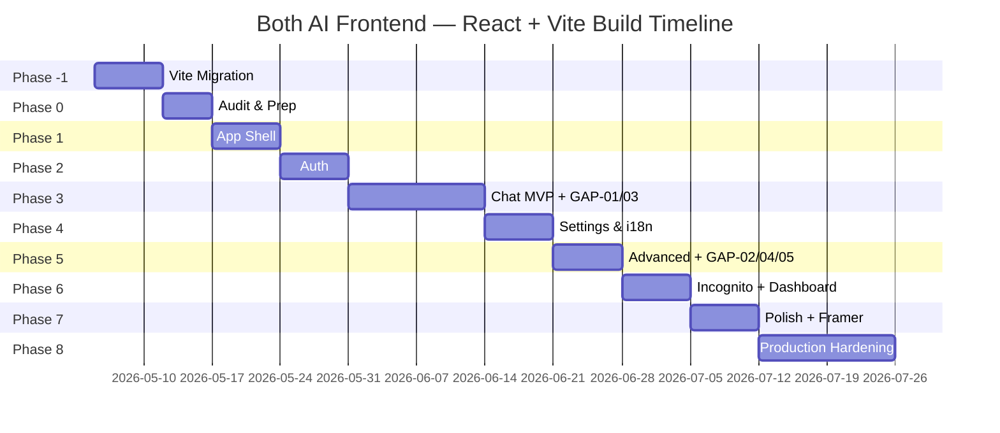

# Both AI — Frontend Implementation Roadmap
## React + Vite SPA — Phased Build Plan

---

<!-- PATCH: Phase -1 (React + Vite Migration) added as prerequisite -->
## Phase -1 — React + Vite Migration [NEW]
*Run in parallel with or before Phase 0*

> **Goal:** Bootstrap the React + Vite SPA, migrate design tokens, configure all tooling.

| # | Task | Description |
|---|---|---|
| -1.1 | Vite scaffold | `npm create vite@latest frontend -- --template react-ts`; verify HMR at localhost:3000 |
| -1.2 | TailwindCSS setup | Install Tailwind + PostCSS; configure `darkMode: 'class'`; verify utility classes render |
| -1.3 | React Router v6 | Install `react-router-dom`; set up `router.tsx` with all routes; add `ProtectedRoute.tsx` guard |
| -1.4 | Zustand stores scaffold | Create 5 empty stores: `chatStore`, `authStore`, `uiStore`, `i18nStore`, `agentStore` (new) |
| -1.5 | Axios client | Create `src/api/client.ts` with JWT interceptor (`Authorization: Bearer {token}`) + 401 redirect |
| -1.6 | React Query setup | Wrap `App.tsx` in `<QueryClientProvider>`; configure stale-time defaults |
| -1.7 | i18next migration | Replace custom `TRANSLATIONS` object with `i18next` + `react-i18next`; extract 10 existing locale files to `src/i18n/locales/` |
| -1.8 | Design token migration | Port CSS custom properties to Tailwind config as `theme.extend.colors`, `spacing`, `borderRadius` |
| -1.9 | Framer Motion install | Install `framer-motion`; create `src/styles/animations.css` with reusable motion variants |
| -1.10 | Vite code splitting | Configure `manualChunks` for vendor / ui / i18n splits; verify < 300KB initial bundle |
| -1.11 | vercel.json update | Update for SPA fallback: `{ "rewrites": [{ "source": "/(.*)", "destination": "/index.html" }] }` |
| -1.12 | DOMPurify setup | Install `dompurify`; configure marked.js + highlight.js pipeline in `src/utils/markdown.ts` |

**Milestone Criteria:**
- [ ] Vite dev server running at localhost:3000 with HMR
- [ ] All 5 Zustand stores created (even if empty)
- [ ] `apiCall` equivalent working as `src/api/client.ts`
- [ ] i18next initialized with English locale
- [ ] Framer Motion `motion.div` renders without errors

---

## Phase 0 — Audit & Preparation (Week 1)

> **Goal:** Establish directory structure and map all existing vanilla JS components to React equivalents.

| # | Task | Description |
|---|---|---|
| 0.1 | Component inventory | Map each vanilla JS module to its React component target (see FILE_STRUCTURE.md) |
| 0.2 | Asset migration | Move icons, fonts, images to `public/assets/`; update all import paths |
| 0.3 | API contract audit | Verify all `/chat/*`, `/auth/*`, `/settings/*` endpoints match backend ARCHITECTURE.md |
| 0.4 | i18n key extraction | Extract all translation strings from existing `chat.js` TRANSLATIONS into `src/i18n/locales/*.json` |
| 0.5 | Store hydration plan | Define what each Zustand store reads from localStorage on first render |
| 0.6 | Dev environment | Configure ESLint + Prettier; verify TypeScript strict mode passes |

**Milestone Criteria:**
- [ ] Full component map created (vanilla module → React component)
- [ ] All 10 locale JSON files extracted and validated
- [ ] TypeScript strict mode enabled with 0 errors in scaffold

---

## Phase 1 — App Shell (Week 2)

> **Goal:** Build the persistent React layout — Sidebar + Topbar + AppShell.

| # | Task | Description |
|---|---|---|
| 1.1 | `AppShell.tsx` | Root layout: Sidebar (left) + main area. TailwindCSS flex layout. |
| 1.2 | `Sidebar.tsx` | Collapsible: 68px icons-only / 260px full. Framer Motion width transition (300ms). |
| 1.3 | `ConversationList.tsx` | Grouped headers (Today/Yesterday/Previous 7 Days/Older). React Query fetch from `/chat/history`. |
| 1.4 | Context menu | Right-click on ConversationItem → Rename / Archive via `useRef` + Framer dropdown |
| 1.5 | `Topbar.tsx` | Hamburger toggle + ModelSelector dropdown + NewChatButton |
| 1.6 | `UserProfile.tsx` | Avatar + name + dropdown (Profile/Language/FAQ/Logout) |
| 1.7 | `ProtectedRoute.tsx` | HOC: checks `AuthStore.isAuthenticated`; redirects to `/login` if false |
| 1.8 | Responsive | Mobile: Sidebar as Framer Motion overlay with backdrop. Tablet: collapsed icons. Desktop: full. |

**Milestone Criteria:**
- [ ] Sidebar animates expand/collapse smoothly (Framer Motion)
- [ ] Conversation list renders from API with grouped headers
- [ ] Context menu appears on right-click / long-press
- [ ] ProtectedRoute redirects unauthenticated users

---

## Phase 2 — Authentication (Week 3)

> **Goal:** Implement login, register, and onboarding with React.

| # | Task | Description |
|---|---|---|
| 2.1 | `LoginPage.tsx` | Google + GitHub OAuth buttons; email/password fallback |
| 2.2 | `RegisterPage.tsx` | Mirror login with register endpoint + display name input |
| 2.3 | `OAuthCallback.tsx` | Handle `/auth/callback` — extract code → POST to backend → store JWT in AuthStore |
| 2.4 | JWT persistence | `AuthStore` reads `localStorage['both_token']` on app init; stores on login |
| 2.5 | `OnboardingWizard.tsx` | 3-step Framer Motion wizard: StepName → StepTopics → StepLanguage → POST `/onboarding/` |
| 2.6 | Auth guards | Check `/auth/me` response; if `onboarding_done = false` → redirect to `/onboarding` |
| 2.7 | Error handling | Invalid credentials, OAuth failure, rate limit → toast notification via `Toast.tsx` |

**Milestone Criteria:**
- [ ] User can log in via Google OAuth and reach `/chat`
- [ ] New user completes 3-step onboarding wizard
- [ ] Expired JWT redirects to `/login` without data loss

---

## Phase 3 — Chat Interface MVP (Week 4–5)

> **Goal:** Core chat — send, stream, render. Plus connect ConfidenceBadge and AgentStatusBar.

| # | Task | Description |
|---|---|---|
| 3.1 | `WelcomeScreen.tsx` | WebGL Orb + time-based greeting + rotating phrases (i18next) + SuggestionCards |
| 3.2 | `Composer.tsx` | Auto-resize textarea + send button + Shift+Enter; disables during streaming |
| 3.3 | `useChat.ts` hook | POST `/chat/` → ReadableStream SSE parse → ChatStore update |
| 3.4 | `useSSE.ts` hook | Generic SSE hook: read `text/event-stream`, parse `data:` frames, emit events |
| 3.5 | `MessageBubble.tsx` | User + assistant variants; avatar; content; timestamp; ActionBar (copy/regenerate/feedback) |
| 3.6 | Markdown pipeline | marked.js + highlight.js + DOMPurify in `src/utils/markdown.ts` |
| 3.7 | `ThinkBlock.tsx` | Collapsible `<think>` block; Framer Motion expand/collapse |
| 3.8 | `TypingIndicator.tsx` | 3-dot CSS pulse animation; shown while streaming |
| 3.9 | `useSSE.ts` confidence | Parse `confidence` field from SSE payload → `AgentStore.confidenceMap[messageId]` |
| 3.10 | **`ConfidenceBadge.tsx` [UI-GAP-03]** | Render below assistant message timestamp; high/medium/low tier; tooltip with agent + model info |
| 3.11 | **`AgentStatusBar.tsx` [UI-GAP-01]** | Connect to `AgentStore.activeAgent`; subscribe to WS `agent_step` events from `ws.py`; abort button |
| 3.12 | `useWebSocket.ts` *(initial)* | Establish WS connection to `/ws`; dispatch `agent_step` events to `AgentStore` |

**Milestone Criteria:**
- [ ] User sends message; streamed response renders token by token
- [ ] Code blocks have syntax highlighting and copy button
- [ ] `<think>` blocks collapsible
- [ ] ConfidenceBadge visible on all assistant messages with correct tier color
- [ ] AgentStatusBar appears and fades during task execution

---

## Phase 4 — Settings & i18n (Week 6)

> **Goal:** Settings modal + full i18next internationalization.

| # | Task | Description |
|---|---|---|
| 4.1 | `SettingsModal.tsx` | Framer Motion AnimatePresence overlay; tabbed sidebar; Escape closes |
| 4.2 | `ProfileTab.tsx` | Avatar upload + display name + `PUT /settings/profile` |
| 4.3 | `LanguageTab.tsx` | 11-language grid; click → `PUT /settings/language` + i18next `changeLanguage()` |
| 4.4 | `InterfaceTab.tsx` | 8 toggles wired to UIStore; persist to localStorage |
| 4.5 | `ChatTab.tsx` | Archive all / Delete all / Import / Export with ConfirmDialog |
| 4.6 | `FAQTab.tsx` + `AboutTab.tsx` | Accordion FAQ (i18next keys) + version info |
| 4.7 | i18next namespaces | Split into: `common`, `chat`, `settings`, `onboarding`, `errors` |
| 4.8 | Arabic RTL | Add `dir="rtl"` to `<html>` when `ar` is active; test Tailwind RTL utilities |

**Milestone Criteria:**
- [ ] All 6 settings tabs functional
- [ ] Language change updates entire UI immediately (no reload)
- [ ] Arabic RTL layout renders correctly

---

## Phase 5 — Advanced Chat Features (Week 7)

> **Goal:** Search, attachments, voice, TaskProgressPanel, MemoryPanel, AutonomyControl.

| # | Task | Description |
|---|---|---|
| 5.1 | `SearchPalette.tsx` | Cmd+K overlay; fuzzy search conversations; arrow navigation; Framer Motion scale animation |
| 5.2 | File attachments | Attach button → file picker → preview chips in Composer → FormData POST |
| 5.3 | `useVoiceInput.ts` | Web Speech API; language-mapped; records → transcript → Composer textarea |
| 5.4 | **`TaskProgressPanel.tsx` [UI-GAP-02]** | Collapsible inline panel; task decomposition tree from `task_decomposed` WS event; per-sub-task status; progress bar |
| 5.5 | **`MemoryPanel.tsx` [UI-GAP-04]** | Sidebar slide-out; React Query `GET /memory/user`; delete item `DELETE /memory/user/{id}` (optimistic); clear all |
| 5.6 | **`AutonomyControl.tsx` [UI-GAP-05]** | Full variant in InterfaceTab; compact variant in Topbar; `PATCH /settings/autonomy`; UIStore.autonomyLevel |
| 5.7 | Keyboard shortcuts | Cmd+K search, Cmd+Shift+N new chat, Esc close overlays |
| 5.8 | Branch selector | UI for response variant selection (stub, backend feature future) |
| 5.9 | Widescreen mode | UIStore.widescreen → TailwindCSS max-width toggle |

**Milestone Criteria:**
- [ ] Cmd+K opens search palette with full keyboard navigation
- [ ] File attachments send successfully with message
- [ ] TaskProgressPanel appears on multi-step task WS event
- [ ] MemoryPanel lists and deletes memories via API
- [ ] AutonomyControl persists to API and localStorage

---

## Phase 6 — Incognito & Dashboard (Week 8)

> **Goal:** Private session mode and usage statistics page.

| # | Task | Description |
|---|---|---|
| 6.1 | `IncognitoPage.tsx` | Standalone page; no sidebar; in-memory Zustand state only; no localStorage writes |
| 6.2 | Incognito guard | Override API client to strip JWT; POST to `/chat/` with `incognito: true` flag |
| 6.3 | Incognito header | Mask icon + "Private Session" badge (amber Tailwind color) + exit button |
| 6.4 | `DashboardPage.tsx` | Stats cards (total users, earnings); React Query `GET /dashboard/`; Xendit withdraw button |
| 6.5 | Ripple navigation | Framer Motion expanding circle transition on Incognito entry |
| 6.6 | `DocsPage.tsx` | Embedded documentation viewer (optional, markdown files rendered) |

**Milestone Criteria:**
- [ ] Incognito session: no localStorage writes confirmed via DevTools
- [ ] Dashboard stats render correctly from API
- [ ] Ripple transition animates on incognito entry/exit

---

## Phase 7 — Polish & Framer Motion Migration (Week 9)

> **Goal:** Replace all CSS-only animations with Framer Motion; test AgentStore end-to-end.

| # | Task | Description |
|---|---|---|
| 7.1 | Framer Motion migration | Replace CSS transitions on: overlays, sidebar, settings modal, search palette, toasts |
| 7.2 | `Toast.tsx` | Unified notification with Framer AnimatePresence queue; success/error/info/warning types |
| 7.3 | `Skeleton.tsx` | Loading skeleton for conversation list and message history |
| 7.4 | `Modal.tsx` | Generic modal wrapper with backdrop blur + Framer Motion scale-in |
| 7.5 | `ConfirmDialog.tsx` | Destructive action confirmation (delete all, clear memory) |
| 7.6 | AgentStore integration test | Simulate WS events → verify AgentStatusBar, TaskProgressPanel, ConfidenceBadge all update correctly |
| 7.7 | Empty states | Illustrations for no conversations, no search results, memory panel empty |
| 7.8 | Error boundaries | React `ErrorBoundary` wrappers on all page components |

<!-- PATCH: added Framer Motion migration and AgentStore integration test tasks -->

**Milestone Criteria:**
- [ ] All overlays animate with Framer Motion (no CSS-only transitions remaining)
- [ ] AgentStore → AgentStatusBar → TaskProgressPanel data flow verified end-to-end
- [ ] Toast system shows on all user actions

---

## Phase 8 — Production Hardening (Week 10–12)

> **Goal:** Performance, accessibility, security, deployment.

| # | Task | Description |
|---|---|---|
| 8.1 | Lighthouse audit | Target ≥90 all categories; fix all flagged items |
| 8.2 | Bundle analysis | `vite-bundle-visualizer`; ensure Monaco is lazy-loaded only |
| 8.3 | WCAG 2.1 AA audit | Screen reader test; focus management; color contrast |
| 8.4 | RTL verification | Arabic layout test on all pages; Topbar, Sidebar, Composer all RTL-correct |
| 8.5 | Cross-browser test | Chrome, Firefox, Safari, Edge — latest 2 versions each |
| 8.6 | Mobile test | iOS Safari + Android Chrome; all breakpoints; touch interactions |
| 8.7 | SEO meta tags | OG image, description, title on all public pages |
| 8.8 | PWA manifest | `public/manifest.json` + `sw.ts` service worker for offline shell |
| 8.9 | Error monitoring | Sentry or lightweight custom tracker; uncaught errors → structured log |
| 8.10 | CI/CD pipeline | GitHub Actions: lint → type-check → build → Vercel deploy on push to main |

**Milestone Criteria:**
- [ ] Lighthouse ≥90 for Performance, Accessibility, Best Practices, SEO
- [ ] 0 critical WCAG violations
- [ ] PWA installable on Chrome/Edge
- [ ] CI pipeline green on all PRs

---

## Timeline Summary

---

## Risk Mitigation

| Risk | Probability | Impact | Mitigation |
|---|---|---|---|
| WebGL Orb breaks on mobile | Medium | Low | Framer Motion CSS gradient fallback |
| SSE streaming fails on slow networks | Medium | High | Retry with exponential backoff + polling fallback |
| React bundle size too large | High | Medium | Code splitting + `React.lazy()` + Monaco lazy-load |
| Zustand store hydration on refresh | Medium | Medium | `zustand/middleware` `persist` with localStorage |
| OAuth redirect URI mismatch | High | High | Register both `localhost` and production URIs |
| WebSocket on Vercel (serverless timeout) | High | High | Deploy WS server to Fly.io / Railway; use SSE as fallback |
| i18next migration breaks existing keys | Medium | Medium | Maintain key-for-key parity with original TRANSLATIONS; run diff test |
| Arabic RTL layout regression | Low | Medium | Automated snapshot test for RTL pages |
